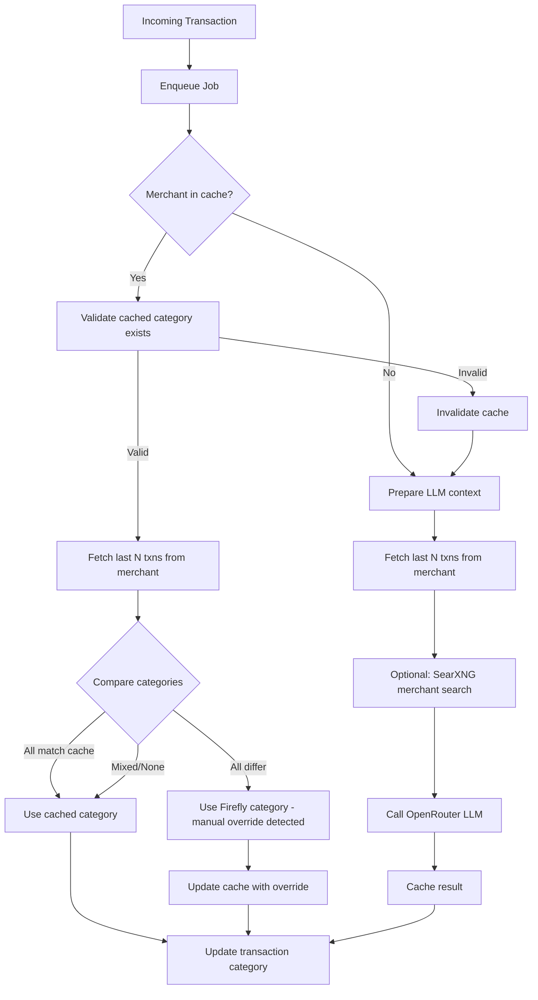

# Firefly III AI Categorize

AI-powered transaction categorization for Firefly III using OpenRouter.

## How It Works



## Setup

```bash
cp .env.example .env
# Edit .env with your credentials

# Development
bun run dev

# Production (Docker)
docker compose up -d
```

## Webhook Configuration

In Firefly III, create a webhook:

- **URL**: `http://your-host:3000/webhook`
- **Trigger**: Store transaction
- **Response**: Transaction

## License

MIT
